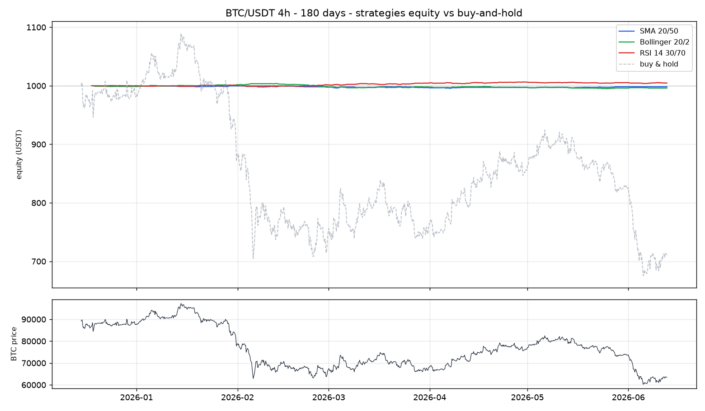

<div align="center">

# bitget-sma-bot

**Open-source Bitget trading bot in Python — pluggable strategies (SMA crossover, Bollinger breakout, RSI mean-revert) for USDT-M perpetual futures, with free demo testnet, paper trading, control dashboard, and Telegram alerts.**

     

[🇬🇧 English](README.md) | [🇫🇷 Français](README.fr.md) · [Installation](INSTALL.md) · [Documentation](docs/) · [Disclaimer](DISCLAIMER.md)


</div>

---

## Why this project exists

Most crypto bots are either paid black boxes or a few-hundred-line scripts impossible to hack on. **bitget-sma-bot** is deliberately small (~2,000 lines of Python), readable in an evening, and meant to be a **solid starting point** for anyone building a systematic crypto trading workflow on Bitget USDT-M perpetuals:

- ✅ 3 pluggable strategies (SMA crossover, Bollinger breakout, RSI mean-revert)
- ✅ 4 execution modes: `paper` (simulated), `dry` (logs only), `demo` (Bitget virtual account), `live` (real money)
- ✅ Full control dashboard: start / stop the bot, tweak the strategy, watch live PnL — **without touching a single line of code**
- ✅ Built-in backtester + grid-search optimizer
- ✅ Telegram alerts, stop-loss, take-profit, % of balance risk sizing
- ✅ End-to-end tested on Bitget demo: real orders, position tracking, PnL verification

---

## At a glance

| Component | Details |
|---|---|
| **Strategies** | SMA crossover, Bollinger breakout, RSI mean-revert — all inherit `Strategy(ABC)`. Add yours = 1 file |
| **Modes** | `paper` (no API key), `dry` (logs), `demo` (real orders on Bitget's virtual account via `paptrading: 1` header), `live` |
| **Risk** | % of balance per trade, stop-loss and take-profit as % from entry, checked on every tick |
| **Notifications** | Telegram on every entry / exit / error (optional) |
| **Backtests** | `backtrader` engine (classic) + small engine for fast grid search |
| **Tests** | 54 pytest tests + 9 end-to-end tests on Bitget demo + 6 UI tests (Playwright) |

---

## 1-click quick start

**Windows**: double-click `install.bat`, edit `.env`, then `start.bat` (the bot) or `start_web.bat` (the dashboard).

**Linux / macOS**:
```bash
chmod +x *.sh
./install.sh
./start_web.sh    # dashboard on :5000
```

Open **http://localhost:5000** and click **Start Bot**.

---

## The control dashboard

Everything happens here. No code editing required.

- **Status hero**: RUNNING / PAUSED / STOPPED badge, uptime, Start / Stop / Pause / Restart buttons
- **5 stat cards**: balance, position, unrealized PnL, last price, last signal
- **TradingView chart**: candles + SMA fast / slow + entry line. Independent symbol + timeframe picker (look at ETH while the bot trades BTC)
- **Equity curve** rebuilt from past trades
- **Activity log**: bot stdout live-tailed every 4 seconds
- **3 config panels**: Strategy (switch SMA / Bollinger / RSI + dynamic params), Risk (RPCT, SL, TP), Mode & Alerts (paper / dry / demo / live + Telegram)
- **Force close button**: closes the current position on the next tick (uses `reduceOnly` exchange-side)

---

## Architecture


See [docs/architecture.md](docs/architecture.md) for the long form.

---

## Backtest results

Conditions: 180 days of real Bitget data, 1,000 USDT starting balance, 2% risk per trade, SL 3%, TP 6%, 0.06% commission. Reproducible:

```bash
python examples/showcase.py --days 180
```

### Best config per pair and timeframe

| Symbol | TF | Strategy | Trades | Win % | Return | Max DD | Sharpe |
|---|---|---|---|---|---|---|---|
| **ETH** | 1d | Bollinger 20/2 | 9 | **66.7%** | **+0.56%** | 0.40% | **+1.38** |
| ETH | 4h | RSI 14 30/70 | 52 | **57.7%** | **+0.85%** | 0.44% | **+0.63** |
| ETH | 1h | SMA 20/50 | 41 | 43.9% | +0.51% | 0.63% | +0.24 |
| BTC | 4h | RSI 14 30/70 | 49 | **59.2%** | **+0.47%** | 0.35% | **+0.43** |
| BTC | 1h | SMA 20/50 | 35 | 42.9% | +0.32% | 0.46% | +0.19 |
| BTC | 1d | Bollinger 20/2 | 7 | 42.9% | +0.20% | 0.34% | +0.66 |

Full grid in `examples/results/showcase/summary.csv`.

### Capital preservation through a 30% crash

Over the same window, BTC dropped from ~91k to ~63k (-30%). Buy-and-hold ended around 700 USDT. The three strategies held the line near 1,000 USDT.



The bot doesn't ride bull markets. It **sidesteps big drawdowns**. That's the canonical trade-off of a systematic system.

---

## Available strategies

| Name | Module | Params | Idea |
|---|---|---|---|
| `sma_crossover` | [src/strategies/sma_crossover.py](src/strategies/sma_crossover.py) | `fast`, `slow` | Long when fast SMA crosses above slow, short on the reverse. |
| `bollinger` | [src/strategies/bollinger.py](src/strategies/bollinger.py) | `period`, `std` | Long on breakout above upper band, short on break below lower band. |
| `rsi_mean_revert` | [src/strategies/rsi_mean_revert.py](src/strategies/rsi_mean_revert.py) | `period`, `oversold`, `overbought` | Long when RSI rebounds from oversold, short when it falls from overbought. |

Adding your own = create a file in `src/strategies/`, inherit `Strategy`, register it in `__init__.py::STRATEGIES`. The trader and the optimizer pick it up automatically.

```python
# src/strategies/my_strategy.py
from .base import Strategy, Decision

class MyStrategy(Strategy):
    name = "my_strategy"
    def __init__(self, lookback=14):
        self.lookback = lookback
    def warmup(self) -> int:
        return self.lookback + 1
    def signal(self, df) -> Decision:
        # your rule here
        return Decision("flat", "not yet implemented")
```

---

## Bitget demo mode (recommended before going live)

Bitget offers a demo account with virtual money. The bot supports it through the `paptrading: 1` header (see [Bitget official docs](https://www.bitget.com/api-doc/common/demotrading/restapi)).

> 🎁 **No Bitget account yet?** Sign up via [the project's referral link](https://www.bitget.com/expressly?languageType=0&channelCode=9K5D7K4J&vipCode=9K5D7K4J) (code `9K5D7K4J`).
>
> **What you get**: the current Bitget welcome bonus + fee discounts (the exact amount is set by Bitget and shown on the signup page).
> **What the project gets**: a share of the trading fees you pay to Bitget (no extra cost on your side). This is how the bot stays free and open-source — full disclosure.
> **For the affiliation to count**: sign up via this link (the code is pre-filled), complete KYC. Commissions only trigger on real trading volume, not on `demo` mode.

1. https://www.bitget.com/asset/demo-trading — activate the demo account
2. Switch to demo mode in the Bitget dashboard (top of the page)
3. Personal Center → API Key Management → **Create Demo API Key** (separate from live keys)
4. Permissions: Read + Trade + Futures. **No** Withdrawal.
5. Drop the values in `.env`:
   ```env
   BITGET_API_KEY=...
   BITGET_API_SECRET=...
   BITGET_API_PASSWORD=...
   MODE=demo
   ```
6. Sanity-check everything before running the bot:
   ```bash
   python scripts/test_demo_connection.py
   ```

---

## Tests

```bash
pytest                                        # 54 tests, ~2 min
python scripts/e2e_full_demo.py               # 9 end-to-end tests on Bitget demo
python scripts/test_ui_smoke.py               # 6 Playwright UI tests
```

Coverage:
- **Unit**: indicators, strategies, trader (paper / dry / demo / live), SL / TP, registry
- **API contract**: every Flask endpoint + input validation
- **E2E exchange**: real market orders on Bitget demo, position checking, PnL accounting, edge cases
- **UI smoke**: Playwright headless, Start / Stop click flow, dropdowns, JS error guard

---

## Tech stack

| Layer | Choice |
|---|---|
| Language | Python 3.11+ |
| Exchange connection | [ccxt](https://github.com/ccxt/ccxt) (multi-exchange, configured for Bitget) |
| Backtests | [backtrader](https://www.backtrader.com/) + lightweight in-house engine |
| Notifications | [python-telegram-bot](https://github.com/python-telegram-bot/python-telegram-bot) v20+ |
| Dashboard | Flask + Tailwind CSS (CDN) + [lightweight-charts](https://github.com/tradingview/lightweight-charts) |
| Tests | pytest + Playwright |
| Containerization | Dockerfile + docker-compose |

---

## Project layout

```
src/
  config.py              .env loading + mode / strategy validation
  exchange.py            ccxt Bitget wrapper (sets the paptrading header in demo mode)
  indicators.py          SMA, EMA, RSI, Bollinger bands
  strategies/            pluggable framework
    base.py              Strategy(ABC), Decision, Signal
    sma_crossover.py     SMA strategy
    bollinger.py         Bollinger strategy
    rsi_mean_revert.py   RSI strategy
    __init__.py          registry + make_strategy() factory
  trader.py              main loop: SL/TP check, signal, paper/demo/live dispatch
  backtest.py            backtrader engine
  simple_backtest.py     small bar-by-bar engine for grid search
  telegram_notifier.py   async Telegram client
  web.py                 Flask dashboard
  main.py                bot entry point

examples/
  run_backtest.py        backtrader-based backtest
  optimize.py            grid-search optimizer
  showcase.py            18 backtests + comparison chart

scripts/
  test_demo_connection.py   Bitget demo smoke test
  e2e_full_demo.py          9-test E2E suite
  test_ui_smoke.py          Playwright UI tests
  take_screenshots.py       dashboard capture

tests/                  54 pytest tests

docs/                   architecture, strategy, setup
```

---

## Disclaimer

Educational tool. **Do not use `live` mode with money you cannot afford to lose.** Trading futures with leverage can wipe out a balance in minutes. Read [DISCLAIMER.md](DISCLAIMER.md) before going further.

---

## License

[MIT](LICENSE).

---

<div align="center">

**If this project helped you, drop a ⭐ — it helps other devs find it.**

</div>
