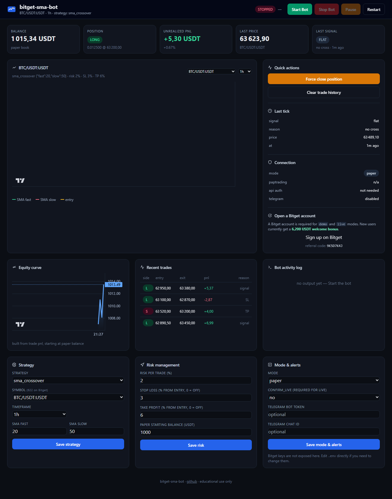
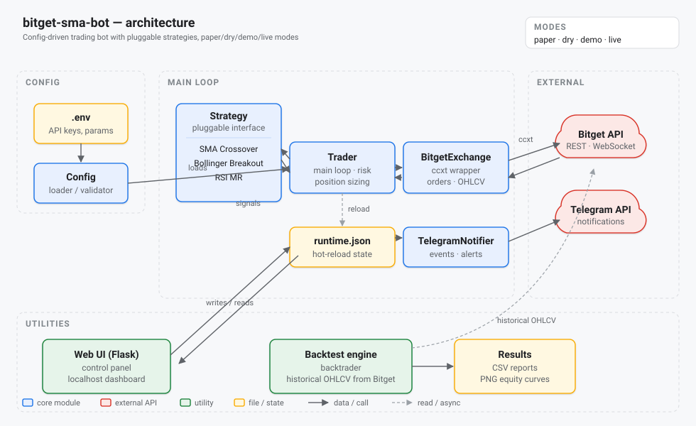
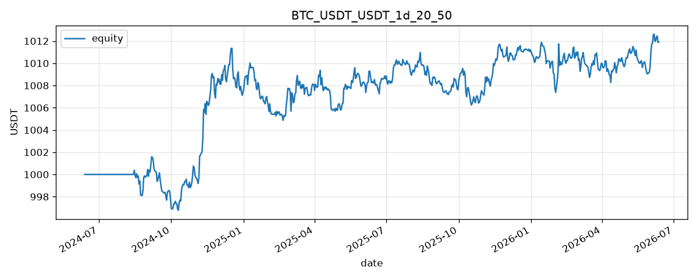

# bitget-sma-bot

A small, readable crypto trading bot for Bitget USDT-M futures. Three pluggable
strategies (SMA crossover, Bollinger breakout, RSI mean revert), four execution
modes (paper / dry / demo / live), a Flask config UI, Telegram alerts, a
backtrader engine, and a grid-search optimizer. Written to be hackable in an
evening.

> **For learning. Do not run in `live` mode with money you cannot afford to
> lose. Read [DISCLAIMER.md](DISCLAIMER.md) first.**

---

## What it does

- Pulls OHLCV candles from Bitget through [ccxt](https://github.com/ccxt/ccxt).
- Runs a pluggable strategy (default: SMA 20/50 crossover) and trades the signal.
- Four modes:
  - `paper` — no orders, simulated balance, no API keys needed
  - `dry` — no orders, decisions logged only
  - `demo` — **real orders on Bitget's demo account** (virtual money, header `paptrading: 1`)
  - `live` — real orders on a real account (requires `CONFIRM_LIVE=yes`)
- Stop-loss and take-profit checked on every tick (logical exits, not exchange-side stops).
- Telegram message on each entry, exit, and error.
- Backtest with `backtrader` (the classic) or with a small built-in engine used by the optimizer.
- Grid-search optimizer that fetches data once and sweeps a JSON-described param grid.
- Minimal Flask UI on `http://localhost:5000` to change runtime params.



---

## Architecture



See [docs/architecture.md](docs/architecture.md) for the long form.

---

## Quick start — 1-click

**Windows**

1. Double-click `install.bat` — creates the venv, installs deps, copies `.env.example` to `.env`.
2. Edit `.env` (your Bitget API keys, your Telegram token, the mode).
3. Double-click `start.bat` to launch the bot, or `start_web.bat` for the config UI.
4. `stop.bat` kills the running processes when you are done.

**Linux / macOS**

```bash
chmod +x *.sh
./install.sh
# edit .env
./start.sh         # bot
./start_web.sh     # web UI on :5000
./stop.sh          # kill
```

## Quick start — manual

```bash
git clone https://github.com/alexch03/bitget-sma-bot
cd bitget-sma-bot
python -m venv .venv
source .venv/bin/activate          # Windows: .venv\Scripts\activate
pip install -r requirements.txt

cp .env.example .env               # then edit with your keys
python -m src.main                 # bot loop
python -m src.web                  # config UI on :5000
```

---

## Demo mode (recommended before live)

Bitget has a real demo environment with virtual money. The bot supports it via
the `paptrading: 1` header per the [official Bitget docs](https://www.bitget.com/api-doc/common/demotrading/restapi).

1. https://www.bitget.com/asset/demo-trading — activate demo trading.
2. Switch to demo mode in the dashboard (top of the page).
3. Personal Center → API Key Management → **Create Demo API Key** (separate from your live keys).
4. Permissions: Read + Trade + Futures. **Do not enable Withdrawal.**
5. Put the three values in `.env`:
   ```
   BITGET_API_KEY=...
   BITGET_API_SECRET=...
   BITGET_API_PASSWORD=...
   MODE=demo
   ```
6. Sanity check before running the bot:
   ```bash
   python scripts/test_demo_connection.py
   ```
   This fetches your balance, places a tiny limit buy 50% below market (cannot
   fill), then cancels it. If everything works, the bot is wired correctly.

---

## Strategies

| Name | Module | Params | What it does |
|---|---|---|---|
| `sma_crossover` | `src/strategies/sma_crossover.py` | `fast`, `slow` | Long on fast SMA crossing above slow, short on the reverse. |
| `bollinger` | `src/strategies/bollinger.py` | `period`, `std` | Long on close breaking above upper band, short on break below lower band. |
| `rsi_mean_revert` | `src/strategies/rsi_mean_revert.py` | `period`, `oversold`, `overbought` | Long when RSI rebounds from oversold, short when it falls from overbought. |

Add your own: subclass `Strategy` in `src/strategies/`, register it in
`src/strategies/__init__.py::STRATEGIES`. The trader and the optimizer pick
it up automatically.

```python
# src/strategies/my_strategy.py
from .base import Strategy, Decision

class MyStrategy(Strategy):
    name = "my_strategy"
    def __init__(self, lookback=14):
        self.lookback = lookback
    def warmup(self) -> int:
        return self.lookback + 1
    def signal(self, df) -> Decision:
        # your rule here
        return Decision("flat", "not implemented")
```

---

## Stop-loss / Take-profit

Both are configured as a `%` from entry price in `.env`:

```
STOP_LOSS_PCT=3         # exit if price moves 3% against you
TAKE_PROFIT_PCT=6       # exit if price moves 6% in your favour
```

Setting either to `0` disables it. SL/TP are checked **locally** on every loop
tick — no stop order is placed on Bitget. If the bot is down when price moves,
no exit happens. Documented in [docs/strategy.md](docs/strategy.md).

---

## Backtest

```bash
# classic backtrader run, equity PNG + trades CSV in examples/results/
python examples/run_backtest.py --symbol BTC/USDT:USDT --timeframe 1h --days 180
```

### Real results across strategies

Numbers below are from real Bitget OHLCV, 120 days of 1h candles, 1000 USDT
start, 2% risk per trade, 0.06% commission, SL 3% / TP 6%. Reproducible with
`examples/optimize.py`.

**SMA crossover** — best of grid `{fast:[10,20,50], slow:[50,100,200]}`:

| fast | slow | Trades | Win rate | Return | Max DD | Sharpe |
|---|---|---|---|---|---|---|
| 50 | 200 | 4 | 75.0% | +0.20% | 0.07% | 0.72 |
| 20 | 100 | 15 | 40.0% | +0.07% | 0.17% | 0.13 |
| 20 | 200 | 6 | 33.3% | +0.04% | 0.14% | 0.12 |

**Bollinger breakout** — best of grid `{period:[10,20,30], std:[1.5,2.0,2.5]}`:

| period | std | Trades | Win rate | Return | Max DD | Sharpe |
|---|---|---|---|---|---|---|
| 20 | 1.5 | 33 | 42.4% | +0.17% | 0.40% | 0.21 |
| 20 | 2.5 | 19 | 36.8% | +0.08% | 0.35% | 0.11 |
| 20 | 2.0 | 27 | 37.0% | +0.01% | 0.47% | 0.02 |

Honest takeaway: these are trivial baselines. Small edge, low drawdown because
the position size is small. The whole point is to give you a working starting
point to beat with your own ideas.



---

## Optimizer

Sweep a JSON-described grid on real data. Fetches OHLCV once, runs each combo
through the built-in `simple_backtest`, ranks by your chosen metric, saves a CSV.

```bash
python examples/optimize.py \
    --strategy sma_crossover \
    --symbol BTC/USDT:USDT --timeframe 1h --days 120 \
    --grid '{"fast":[10,20,50],"slow":[50,100,200]}' \
    --risk-pct 2 --sl-pct 3 --tp-pct 6 \
    --sort-by sharpe
```

Output goes to `examples/results/optim_<strategy>_<...>.csv`. The top 10 are
printed to stdout.

---

## Configuration reference

All in `.env`. Example template at [`.env.example`](.env.example).

| Variable | Default | Notes |
|---|---|---|
| `MODE` | `paper` | `paper` \| `dry` \| `demo` \| `live` |
| `CONFIRM_LIVE` | `no` | Must be `yes` for `MODE=live` |
| `STRATEGY` | `sma_crossover` | `sma_crossover` \| `bollinger` \| `rsi_mean_revert` |
| `SYMBOL` | `BTC/USDT:USDT` | ccxt symbol |
| `TIMEFRAME` | `1h` | `1m`, `5m`, `15m`, `1h`, `4h`, `1d` |
| `SMA_FAST` / `SMA_SLOW` | `20` / `50` | SMA crossover params |
| `BB_PERIOD` / `BB_STD` | `20` / `2.0` | Bollinger params |
| `RSI_PERIOD` / `RSI_OVERSOLD` / `RSI_OVERBOUGHT` | `14` / `30` / `70` | RSI params |
| `RISK_PCT` | `2.0` | % of balance per trade |
| `STOP_LOSS_PCT` / `TAKE_PROFIT_PCT` | `0` / `0` | 0 = disabled |
| `PAPER_BALANCE` | `1000` | Starting balance in paper mode |
| `BITGET_API_KEY` / `BITGET_API_SECRET` / `BITGET_API_PASSWORD` | empty | Bitget keys |
| `TELEGRAM_BOT_TOKEN` / `TELEGRAM_CHAT_ID` | empty | Telegram is optional |
| `WEB_HOST` / `WEB_PORT` | `127.0.0.1` / `5000` | Flask UI bind |

---

## Project layout

```
src/
  config.py            env loading + mode + strategy validation
  exchange.py          ccxt wrapper around Bitget (sets paptrading header in demo)
  indicators.py        SMA, EMA, RSI, Bollinger bands
  strategy.py          legacy SMA crossover helper (kept for back-compat)
  strategies/          new pluggable framework
    base.py            Strategy ABC, Decision, Signal types
    sma_crossover.py
    bollinger.py
    rsi_mean_revert.py
    __init__.py        registry + make_strategy() factory
  trader.py            main loop: SL/TP check, strategy signal, paper/demo/live
  backtest.py          backtrader engine (used by examples/run_backtest.py)
  simple_backtest.py   small bar-by-bar engine, used by the optimizer
  telegram_notifier.py async Telegram client
  web.py               Flask UI for runtime config
  main.py              entry point

examples/
  run_backtest.py      backtrader-based backtest
  optimize.py          grid-search optimizer
  results/             generated PNGs / CSVs

scripts/
  test_demo_connection.py    Bitget demo sanity check
  take_screenshots.py        Playwright screenshot of the Flask UI

tests/                       34 pytest tests, no network

docs/
  architecture.md     long-form architecture
  strategy.md         strategy rules and trade-offs
  setup.md            install + Bitget + Telegram details
  images/             SVG diagram + UI screenshot
```

---

## Tests

### Unit tests (no network)

```bash
pytest
```

34 unit tests. The exchange and Telegram clients are mocked.

### End-to-end on Bitget demo

`scripts/e2e_full_demo.py` runs a 9-step test suite against the **real Bitget
demo** endpoint with your demo API key. It places small real orders
(~12 USDT notional), watches the position appear via `fetch_positions`, and
cleans up after itself.

```bash
# requires .env with MODE=demo and a Bitget DEMO API key
python scripts/e2e_full_demo.py
```

Coverage:
1. Market buy, position visible on Bitget, market sell to close
2. `Trader.step()` with a forced long signal opens an order and keeps the book in sync
3. Flip long → short closes the long and opens the short on the exchange
4. Stop-loss triggers and closes both book and exchange position
5. Take-profit triggers and closes both
6. Five consecutive `flat` ticks place zero duplicate orders
7. PnL accounting: real balance change after a full cycle is within fees
8. Edge case: amount = 0 is rejected by ccxt
9. Edge case: oversized order raises `InsufficientFunds`
10. Final cleanup verifies no residual position

---

## License

MIT — see [LICENSE](LICENSE).

## Disclaimer

Educational only. Trading futures with leverage can wipe out your account in
minutes. Read [DISCLAIMER.md](DISCLAIMER.md) before going further.
